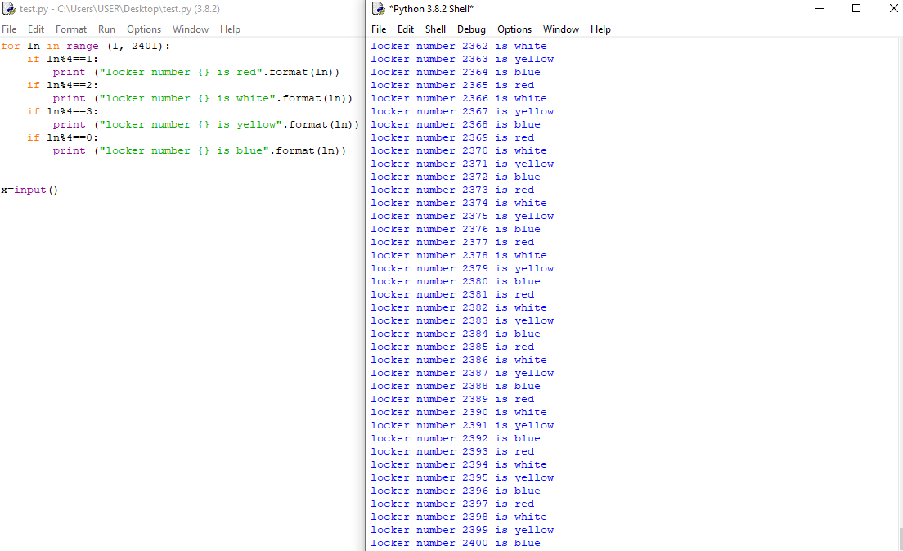

## Question 1: Describe the four core computational thinking skills?
The 4 core computational thinking skills are:

1. Decomposition: it is the process of breaking down a big and complex problem into smaller and manageable steps.

2. Pattern Recognition: identifying similarities between past and current problems and using tricks that worked before again to solve a new similar problem.

3. Abstraction: getting rid of unnecessary parts of the problem to only focus on the few details that are relevant.

4. Algorithmic Thinking: generating a series of consecutive and clear steps for the solver to follow while solving the problem.

## Question 2: What is the most powerful computer? Glad you asked. Watch this video about Sierra Computer. Describe below points that surprised you the most.
-When I saw the super computer, the 1st usage that came to my mind is simulating earthquakes and astrophysics, as told in the beginning in the video. But I was frankly surprised when I learned that it is actually used to simulate nuclear arms for the military. 

-I found the outside design and architecture of Sierra very unexpected. The word ‘super’ is supercomputer indicates highly advanced technology and extreme optimization, thus, I was expecting to see a more optimized and smaller size of the computer. Although, the current design is still very cool looking!

-It is very interesting how computers can make the impossible, possible through simulations. This includes researching a cure for cancer, modeling the collision of blackholes and predicting natural disasters. If put into good use, supercomputers can have a great positive impact on earth that defies the human capacities,

## Question 3: Supercomputers are currently used to investigate solutions to real life problems from cancer research, Ai, economics, or brain simulation. Military uses are also one major force behind the development of these machines. Analyze the benefits and possible drawbacks of developing supercomputers in our modern world? Should we do it?

Nowadays, supercomputers are allowing us to do incredible things beyond human capacities. They have a major contribution in scientific research using simulations which allow researchers to test untestable experiments and to predict possible outcomes. As a consequence, they help us be safer by predicting natural disasters, finding cures for diseases and modeling outer space to give us a better understanding of our universe. In addition, supercomputers like Sierra are ensuring social security by monitoring and simulating old nuclear weapons. 

However, supercomputers are a double-edged weapon and could be extremely dangerous if used by the wrong hands. This includes using them in planning wars and developing deadly weapons. Moreover, their high ability to crack passwords and access accounts could present a real hazard to the privacy and personal information of people. Additionally, if developed to the point of intelligence, supercomputers might take over humanity, although that last point remains science fiction for now.

In conclusion, it is undeniable that supercomputers hold great power that should be used wisely. It is true that they can cause global hazards if in the hands of corrupt governments. However, will we stop cancer cure research which could save thousands of lives? Will we prevent predictions of earthquakes in Japan which could wipe out cities, if not prepared correctly? As long as life continues, bad people will always exist and YES we should be careful about them. However, they should not be a reason for humanity to stop advancing and making positive global impacts through supercomputers.

## Question 4: Identify the most advanced computer in Japan (What, specs, location, uses). We might go and visit it :-)
Fugaku (富岳) is Japan’s most powerful supercomputer located at the RIKEN Center for Computational Science in Kobe, Japan. It is sponsored by MEXT and is scheduled to start operating in 2021. It has an extremely large memory of 4,866,048 GB, a powerful A64FX 48C 2.2GHz PCU and uses the Red Hat Enterprise Linux operating system [1]. It will be used in the data science and artificial intelligence field.

[1] “Supercomputer Fugaku - Supercomputer Fugaku, A64FX 48C 2.2GHz, Tofu Interconnect D.” TOP500, www.top500.org/system/179807/. 


## Programming Task 1
```.py
#This program shows the colors of all lockers from 1 to 2400
for locker_number in range (1, 2401):
    if locker_number%4==1:
        print ("locker number {} is red".format(locker_number))
    if locker_number%4==2:
        print ("locker number {} is white".format(locker_number))
    if locker_number%4==3:
        print ("locker number {} is yellow".format(locker_number))
    if locker_number%4==0:
        print ("locker number {} is blue".format(locker_number))
```
        
## Programming Task 2
```.py
#Using the program above, this program allows the user to enter a number and the program outputs the color that should be used in the locker
locker_number=int(input("Please enter a locker number between 1 and 2400 "))
while locker_number<1 or locker_number>2400:
    locker_number=int(input("Invalid option. Please try again a number between 1 and 2400 "))
if locker_number%4==1:
    print ("locker number {} is red".format(locker_number))
if locker_number%4==2:
    print ("locker number {} is white".format(locker_number))
if locker_number%4==3:
    print ("locker number {} is yellow".format(locker_number))
if locker_number%4==0:
    print ("locker number {} is blue".format(locker_number))
```
     
